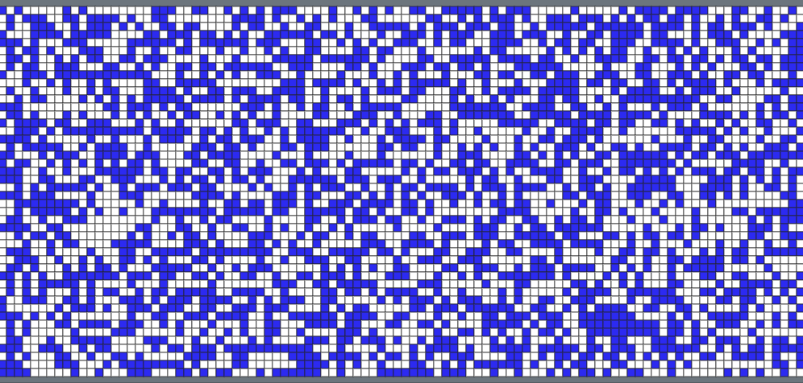
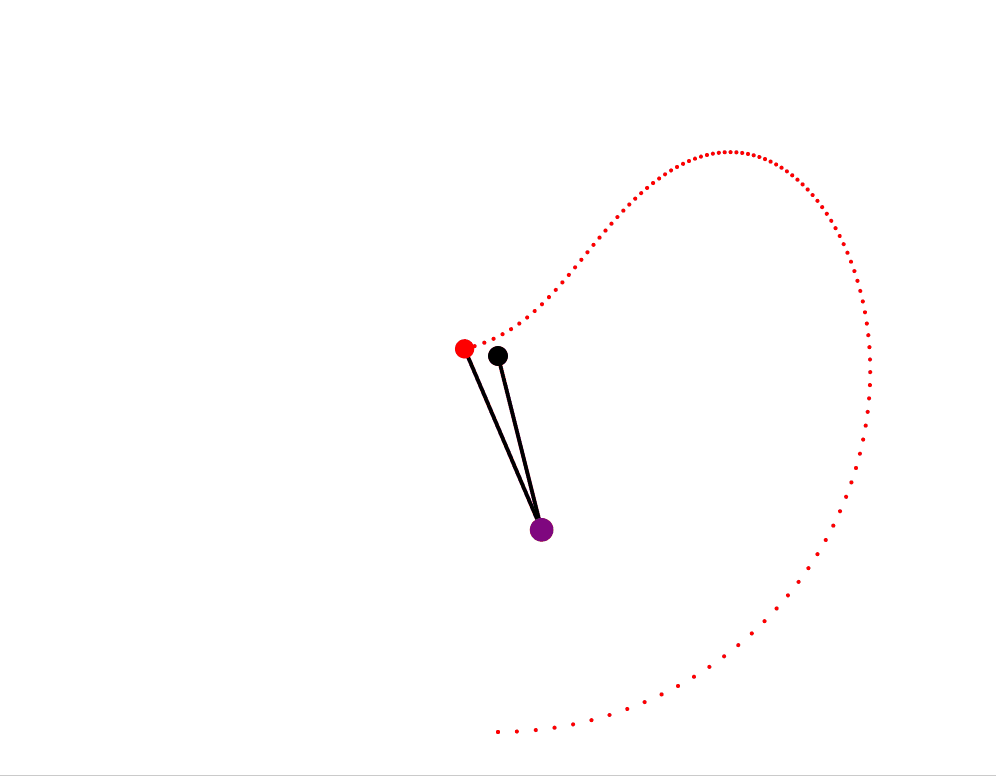
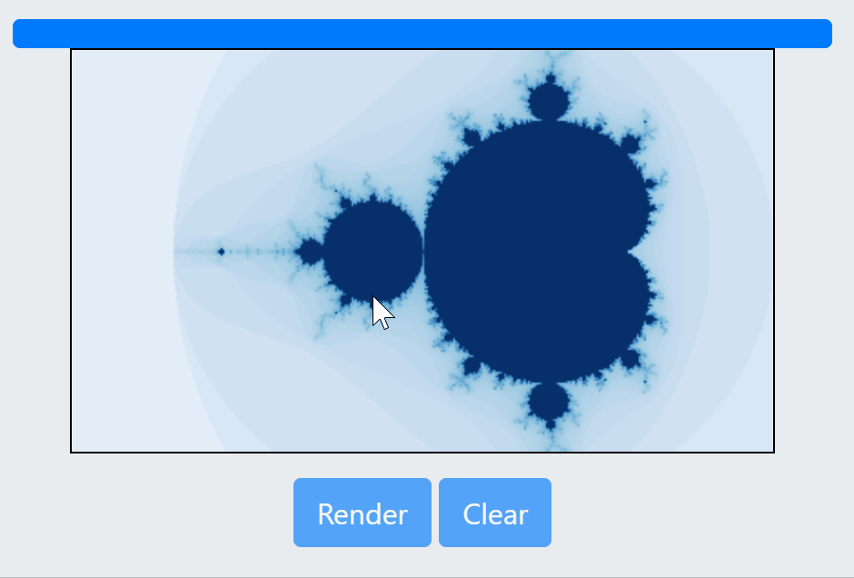

# conway
Conway's game of life and other fun https://jsinkers.github.io/conway/

Interesting play problems to dive into JavaScript.
  
1. [Conway's Game of Life](conway.html). 
Cells live or die at the next generation depending how many neighbours they have: too few and it is as though it is underpopulated, and dies; too many and it is as thought it is overpopulated, and dies.  Living cells with 2 or 3 neighbours stay alive, and otherwise die.  Dead cells with exactly 3 neighbours come to life.  From these simple rules you see static and dynamic patterns emerge.  Each run is randomly seeded with roughly 50% of cells populated.    
It has the following features:
    * clear canvas
    * reset: randomly reseed
    * pause
    * speed slider
    * draw cells on the canvas
 
2. [Double Pendulum](double_pendulum.html) . A classic example of chaotic motion. Simulated using Euler's method. Speeds, masses and lengths are randomly seeded within a set range.  The pendulum produces a trace for the outer pendulum.  It also generates audio based on the relative masses of the pendula, according to their motion.  Note the sounds are interesting but rapidly become irritating.  Have noticed some scenarios where after a long period an instability appears to develop such that \ the energy of the system actually increases - it is expected this is a result of the numerical method/timestep and could be improved by moving to Runge-Kutta 4th order approach.  As it stands the current approach is satisfactory for an interesting animation for the purpose. 

3. [Mandelbrot set](mandelbrot.html).  Set of complex numbers c that remain bounded under the transformation z_n+1 = z_n^2 + c.  Allows you to select a region and re-render zoomed in.  Currently uses an inefficient implementation of the escape time algorithm which can be improved.  There are some bugs with the selection box (on mobile in particular) which can be improved.  Rendering is currently based on the resolution of the viewer, so a smaller window will load faster (but have lower resolution).

4. [Progress bar](progress_bar.html). Bootstrap based progress bar, using a web worker to update progress.  Intended as a template for future work.
5. [Box selector](box_selector.html). Template to create boxes on a canvas by clicking.
6. [The 256 Rules](https://jsinkers.github.io/conway/rule.html) is a 1D cellular automata.  Each cell and its two neighbours can be in state 0 or 1, producing
  8 different possible states.  The next value for each state is determined by taking the rule number (in binary), such that the 
  $n$-th bit corresponds to the next value given current state $n$.  Read more [here](https://plato.stanford.edu/entries/cellular-automata/supplement.html).
